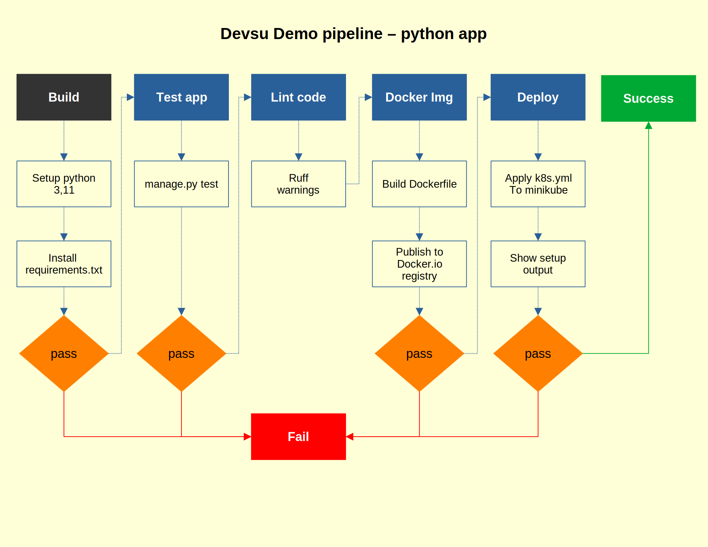

[](https://github.com/erromu/devops_devsu/actions/workflows/django.yml)

# Demo Devops Python

This is a simple DevOps technical test using python app.




## Pipeline Notes

An actions workflow (pipeline) is triggered upon a push, that will perform the steps in the above diagram:
- build
- test
- lint the code (since the app is a demo and may has issues, errors and warnings gotten do not stop the pipeline)
- build a docker image
- publish the docker image to docker.io
- deploy the app to an ephemeral minikube into github actions


The kubernetes setup adds a volume to share the sqlite db across all pod replicas.  An horizontal scalling setup was added to have min 2 replicas and maximun 4.  Note that minikube deployment seems to cut off scaling to 1 replica instead.  Since this is a demo and minikube deployment is an ephemeral aproach just to testing, that behaviour is going to be accepted as ok.

Try to applying the k8s.yml in a localhost minikube if you want to see all replicas in action.

Clone this repository, then call next command (minikube must be running in your localhost)

```bash
kubectl  apply -f k8s.yaml
```

A deployment to docker swarm is included too (docker must be installed in your localhost with an active swarm)
```bash
docker stack deploy -c docker-compose.yml devsu
```

For the sake of this demo the original source code was copied as it is into this repository. That to trigger a push on any hypotetical  commit/push for the original app.  Maybe adding a git sub-module should do the job too.


## Getting Started (demo app)

### Prerequisites

- Python 3.11.3

### Installation

Clone this repo.

```bash
git clone https://bitbucket.org/devsu/demo-devops-python.git
```

Install dependencies.

```bash
pip install -r requirements.txt
```

Migrate database

```bash
py manage.py makemigrations
py manage.py migrate
```

### Database

The database is generated as a file in the main path when the project is first run, and its name is `db.sqlite3`.

Consider giving access permissions to the file for proper functioning.

## Usage

To run tests you can use this command.

```bash
py manage.py test
```

To run locally the project you can use this command.

```bash
py manage.py runserver
```

Open http://localhost:8000/api/ with your browser to see the result.

### Features

These services can perform,

#### Create User

To create a user, the endpoint **/api/users/** must be consumed with the following parameters:

```bash
  Method: POST
```

```json
{
    "dni": "dni",
    "name": "name"
}
```

If the response is successful, the service will return an HTTP Status 200 and a message with the following structure:

```json
{
    "id": 1,
    "dni": "dni",
    "name": "name"
}
```

If the response is unsuccessful, we will receive status 400 and the following message:

```json
{
    "detail": "error"
}
```

#### Get Users

To get all users, the endpoint **/api/users** must be consumed with the following parameters:

```bash
  Method: GET
```

If the response is successful, the service will return an HTTP Status 200 and a message with the following structure:

```json
[
    {
        "id": 1,
        "dni": "dni",
        "name": "name"
    }
]
```

#### Get User

To get an user, the endpoint **/api/users/<id>** must be consumed with the following parameters:

```bash
  Method: GET
```

If the response is successful, the service will return an HTTP Status 200 and a message with the following structure:

```json
{
    "id": 1,
    "dni": "dni",
    "name": "name"
}
```

If the user id does not exist, we will receive status 404 and the following message:

```json
{
    "detail": "Not found."
}
```

## License

Copyright © 2023 Devsu. All rights reserved.
